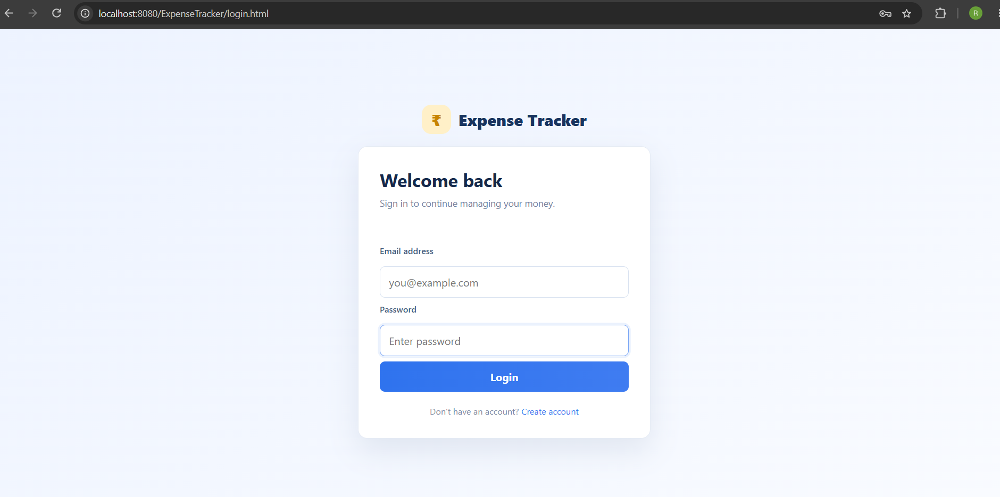
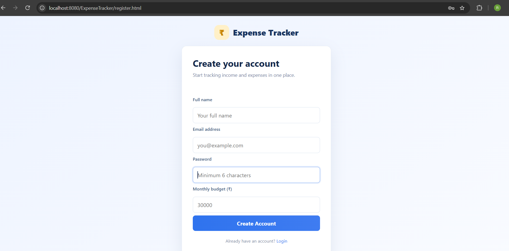
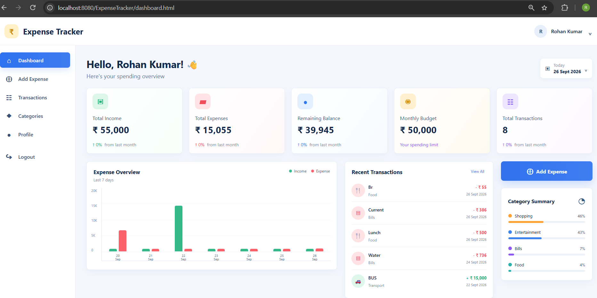
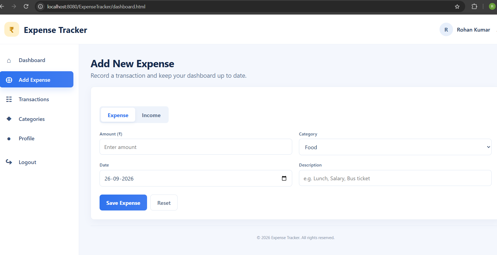
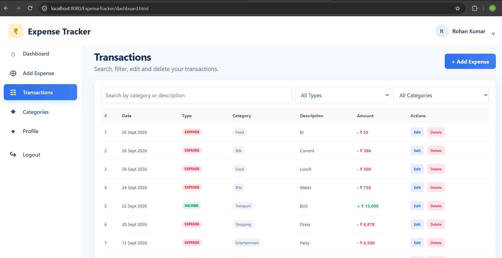
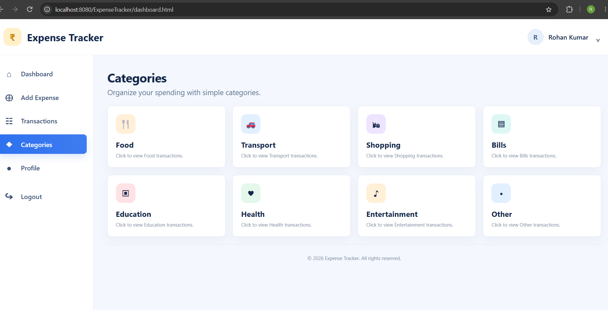
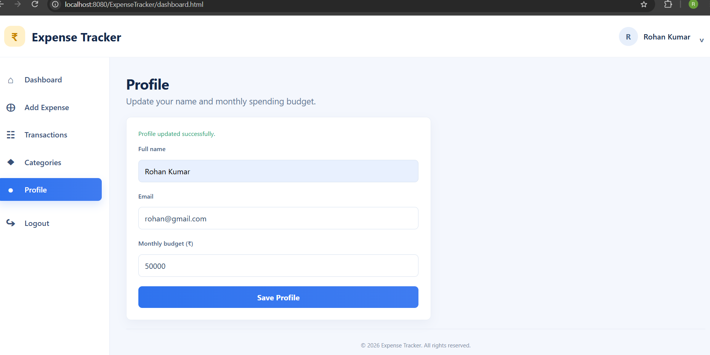

# Expense Tracker - Java Full Stack Web Application

A full-stack web-based Expense Tracker developed using Java, Spring Boot,
HTML, CSS, JavaScript, and MySQL.

## Project Overview

The Expense Tracker allows users to manage their personal income and
expenses through a web application.

Users can:

- Register and login
- Add income
- Add expenses
- View transactions
- Edit transactions
- Delete transactions
- Search transactions
- Filter transactions by type
- Filter transactions by category
- View category-wise spending
- View dashboard analytics
- Set and update monthly budget
- Update profile
- Logout securely

## Technologies Used

### Frontend

- HTML5
- CSS3
- JavaScript

### Backend

- Java
- Spring Boot
- Spring Data JPA
- Hibernate
- REST APIs
- Maven

### Database

- MySQL

### Security

- BCrypt password hashing
- Session-based authentication

## Architecture

```text
                    Browser
                       |
                       v
             HTML + CSS + JavaScript
                       |
                       v
                  REST APIs
                       |
                       v
              Spring Boot
                       |
               +-------+-------+
               |               |
               v               v
            Service       Repository
                               |
                               v
                         JPA / Hibernate
                               |
                               v
                            MySQL
```

## Screenshots

### Login Page



### Register Page



### Dashboard



### Add Expense



### Transactions



### Categories



### Profile


